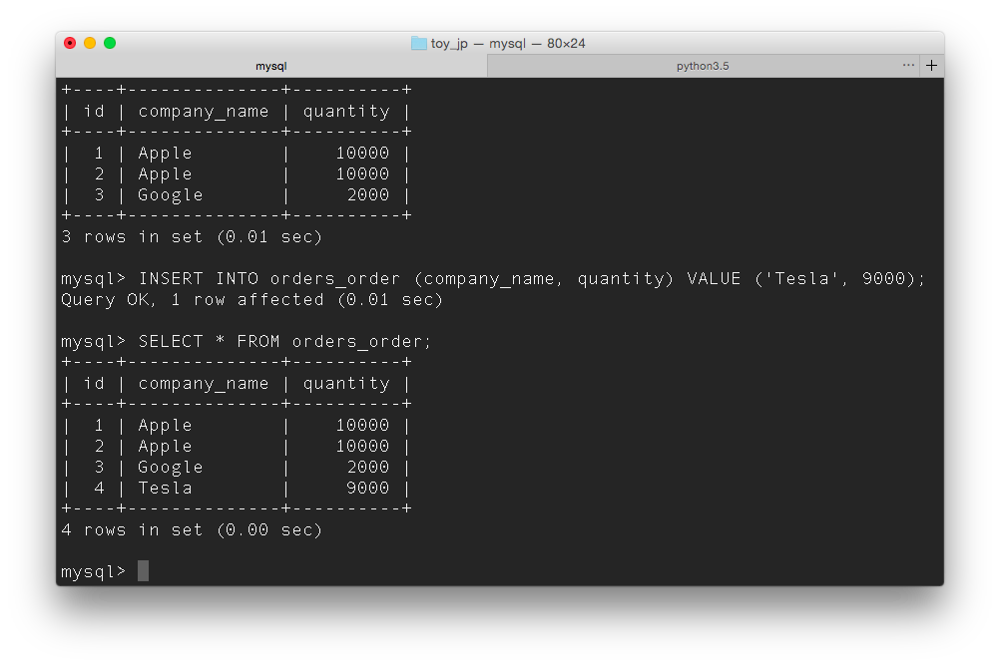
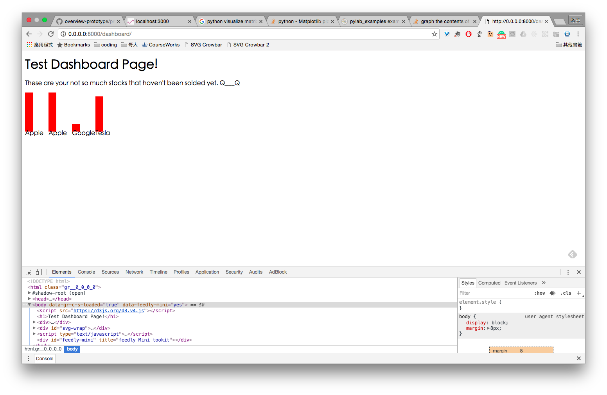
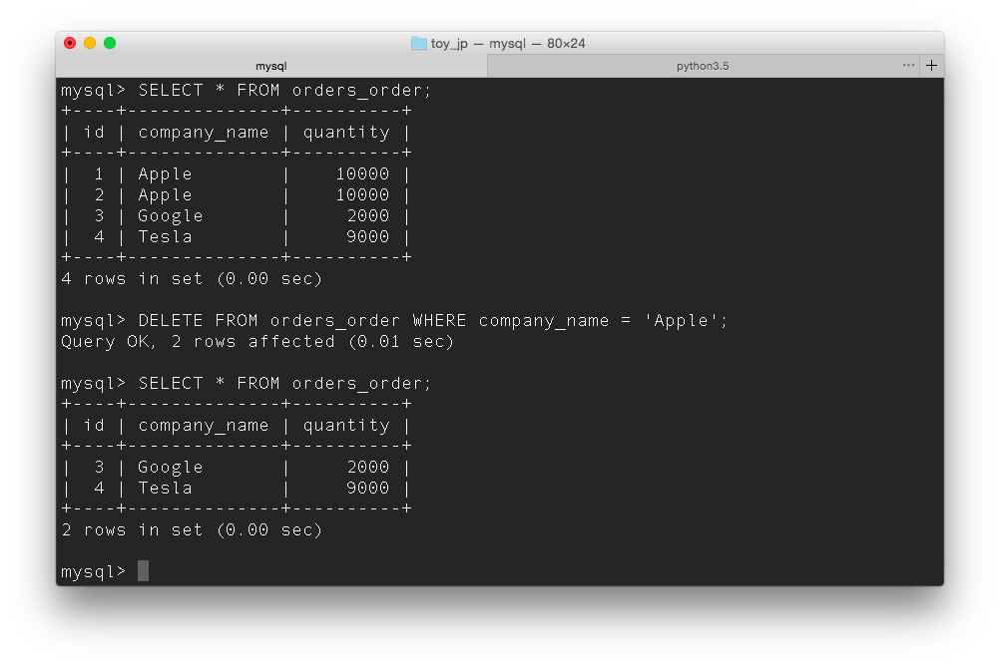
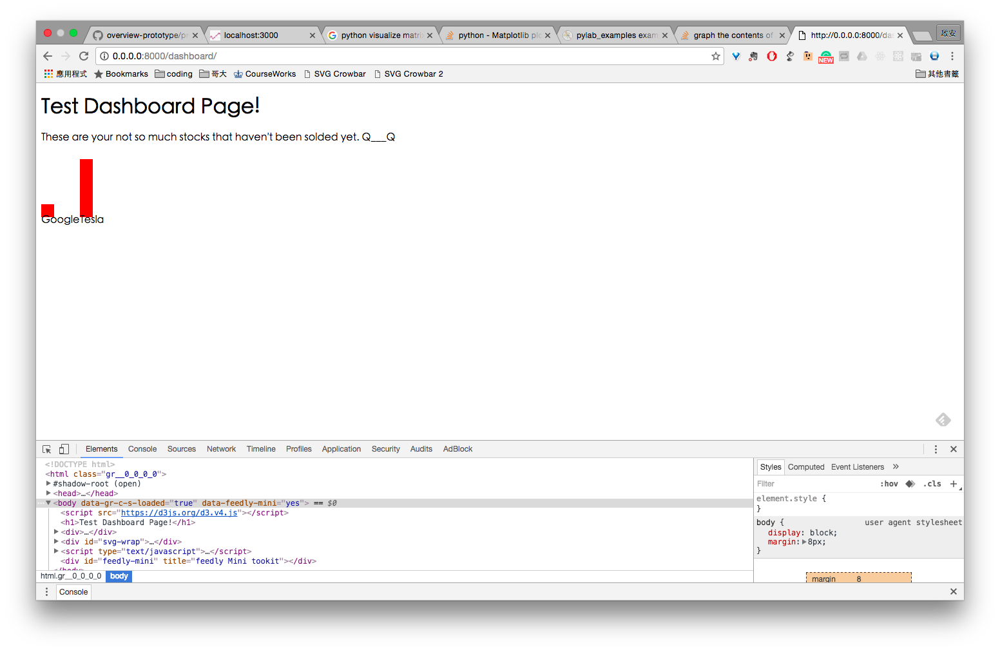

# Launching our toy application

#### Launching our toy jp project

Type in the following command at the project root directory.

```
// use virtual environment 
$ source myprojectenv/bin/activate
python manage.py runserver 0.0.0.0:8000
```


## Process of building this toy project

We have several biggest part of connecting different frameworks. We decide to use **Django**, **MySQL**
 and **d3.js** to build our application and show data and process to our users. Our main task is to link all of them together. Nothing was particularly hard, but it took us a while to understand the structure of Django and connecting it to MySQL server. 


## Database
#### Start mysql database
This part might be different for everyone.
```
/usr/local/Cellar/mysql/5.7.10/bin/mysql.server start
```

#### Log into database
Create a root user before you log in
REF: http://stackoverflow.com/questions/11760177/access-denied-for-root-user-in-mysql-command-line
```
user: root
password: password
```

#### Create a database for this project
A) Create a database
DATABASE NAME: toy_jp
mysql> CREATE DATABASE toy_jp CHARACTER SET UTF8;
Query OK, 1 row affected (0.00 sec)

B) Create a user and grant access to the database
mysql> CREATE USER mw10104587@localhost IDENTIFIED BY 'password';
Query OK, 0 rows affected (0.01 sec)

mysql> GRANT ALL PRIVILEGES ON toy_jp.* TO mw10104587@localhost;
Query OK, 0 rows affected (0.01 sec)

**REF**: https://www.digitalocean.com/community/tutorials/how-to-use-mysql-or-mariadb-with-your-django-application-on-ubuntu-14-04

#### Some Settings
1. Create Virtual Environment for Python
2. Install django mysql
3. Migrate the database
4. Create super user

```
(myprojectenv)Chi-An🀄️ toy_jp $python manage.py createsuperuser
Username (leave blank to use 'wangchi-an'): 
Email address: cw2897@columbia.edu    
Password: 
Password (again): 
Superuser created successfully.
```

#### Populate the database
A) switch to the right database 
```USE toy_jp;```

B) `CREATE TABLE`
watch out for datatype

C) Add content
`INSERT INTO orders (company_name, quantity) VALUE ("Starbucks", 100);`


#### Use Model to access mysql database.
REF: https://docs.djangoproject.com/en/1.10/topics/db/queries/
The `Order` model could be found in `orders/models.py`. It will be included in dashboard for future database access.

<!-- Second Part About loading html files -->


#### How to Load an html file
**REF**: http://stackoverflow.com/questions/14400035/how-to-return-a-static-html-file-as-a-response-in-django

**REF**: https://tutorial.djangogirls.org/en/html/

A) Generated another app called the dashboard, in the dashboard I put all of my related templates in `/dashboard/templates/dashboard`

B) Set up views.py by adding
```
def dashboard(request):
	# get data here
	orders = Order.objects.filter(company_name="Apple")
	t = orders[0].json_object()
	return render(request, 'dashboard/dashboard.html', {'apple': t})
```

This function will be called and the specified html file will be rendered.
Things to note
1. setup the global url under toy_jp/urls.py
2. variables could be passed into the template by the thrid variable in the `render` function. In the template, just use it by the key value and wrap them up with two curly brackets. 
E.G. `{{key}}`


#### How to include database variables into javascript.
By putting the curly brackets in the `<script></script>` in template, the variables


# Testing
## Checking Database Functionality
After adding data, command line showing what's in the database `orders_order`, which means the `order` module under `orders` app.
 
 

We try to remove data, and reloaded the page, and every worked like charm.




## Future Work
It would be more convenient to use django-nvd3 to develop reusable templates.
After we experienced it, we took it into consideration in next development.
**REF**:https://github.com/areski/django-nvd3

#### Platform consistency
Our teammates half are using mac book and half are using windows, I believe we also need to make sure the compatibility of Python version, mysql settings.


# Future Reading:
Outputting csv file with Django:
https://docs.djangoproject.com/en/1.10/howto/outputting-csv/


## Questions to find out
1. Whether to make an api to request data into template, or to use api, or both...
2. How to link static files including css and other js libraries.
3.  

